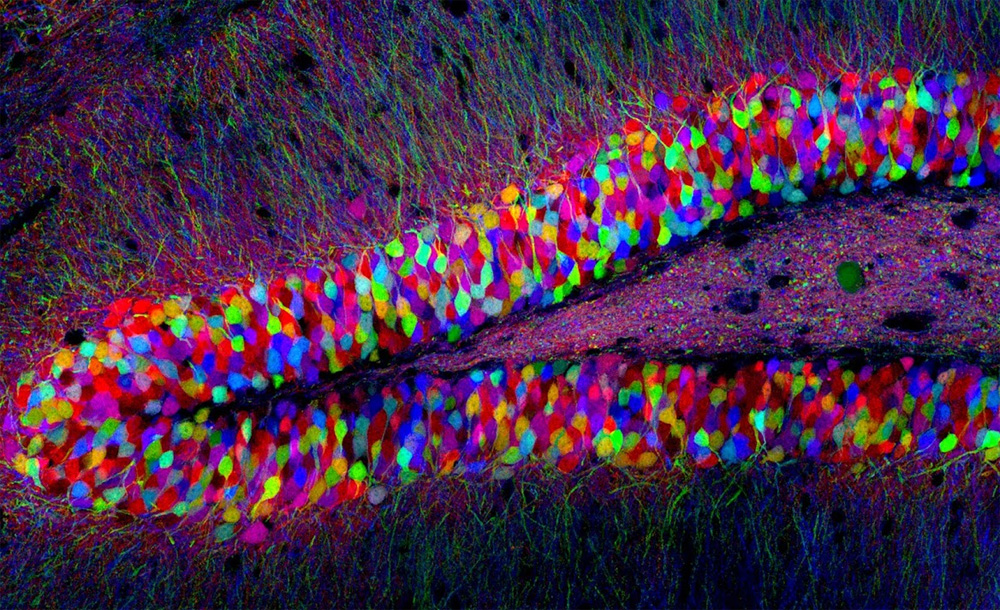
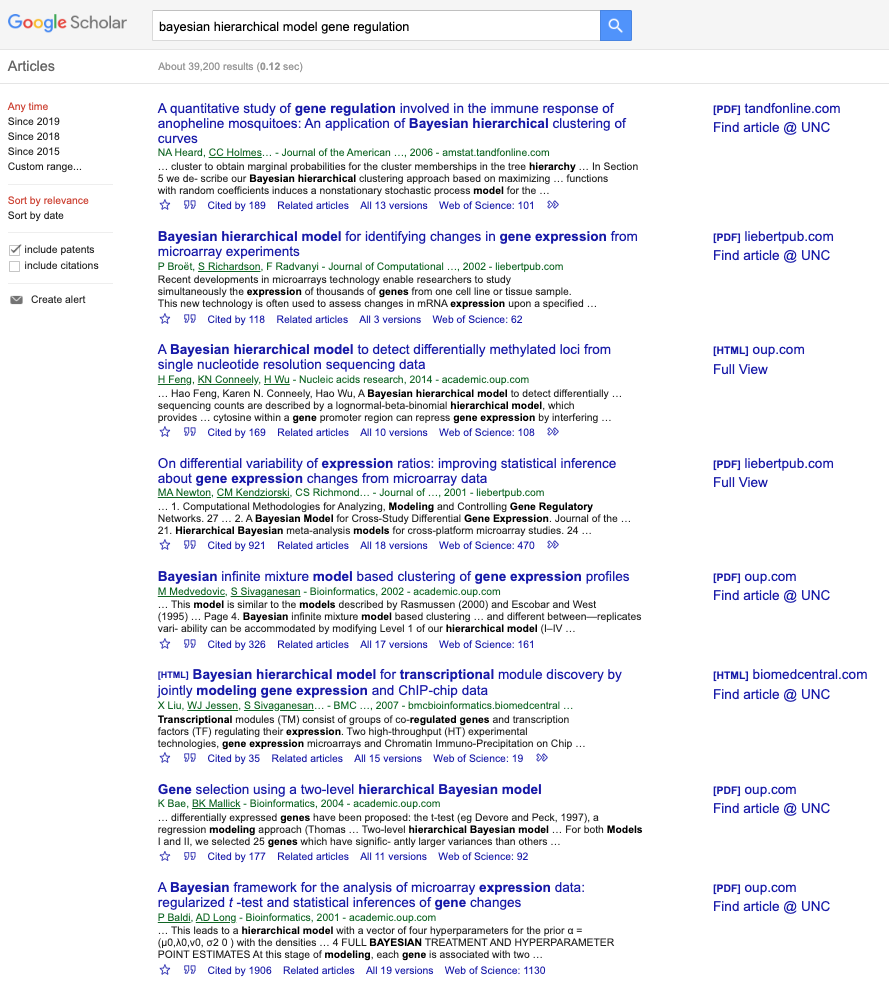
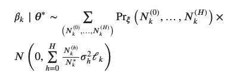
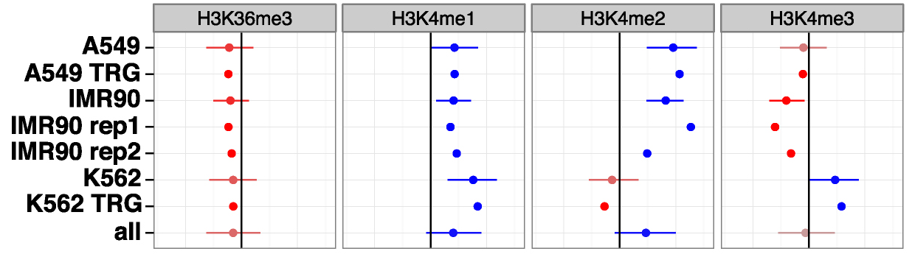

```{r include=FALSE, cache=FALSE}
knitr::opts_chunk$set(fig.width=7, fig.height=5, cache=TRUE) 
```

## Biological aim: cell-type-specific regulation

<p class="fragment">In particular, effect of common genetic variation on ...</p>

<center>

</center>

<p style="font-size: 12px; text-align:center">
Mouse brain, dentate gyrus. Livet, Weissman, Sanes and Lichtman/Harvard University
</p>

## Bayesian Hierarchical Models

<center>

</center>

## Let's demystify — what do we plan to do

<br>

> - A **parametric model** for regulation
> - Parameters will represent an abstract relationship
> - E.g. SNP $\rightarrow$ expression, or SNP $\rightarrow$ chromatin accessibility
> - A **hierarchy** to compare these across cell types
> - Specify (arbitrary) **distributions** relating parameters to e/o
> - **Bayes** theory and comp. frameworks to make inference

## What is a likelihood? 

$$ y_i \sim N(\mu, 1) $$

```{r}
set.seed(1)
y <- rnorm(5, mean=4, sd=1)
```

```{r echo=FALSE, fig.width=8, fig.height=4}
rafalib::bigpar(1,2)
plot(y, rep(0,5), xlim=c(0,8), ylim=c(0, 1),
     xlab=expression(mu),
     yaxt="n", col="blue", ylab="likelihood")
abline(h=0, col=rgb(0,0,0,.2))
s <- 0:80/10
for (i in 1:5) {
  lines(s, dnorm(s, y[i], 1), col="blue")
}
plot(y, rep(0,5), xlim=c(0,8), ylim=c(0, 1),
     xlab=expression(mu),
     yaxt="n", col="blue", ylab="likelihood")
abline(h=0, col=rgb(0,0,0,.2))
s <- 0:800/100
z <- exp(rowSums(sapply(y, function(yy) dnorm(s, yy, 1, log=TRUE))))
lines(s, 100*z/sum(z), col="blue")
```

## Bayesian model

What is a posterior? Likelihood $\times$ some other distribution

<!-- 
$$ f(\hat{\mu}) \propto \prod_i \left[ \varphi(y_i; \mu=\hat{\mu}, \sigma=1) \right] \times g(\hat{\mu}) $$
-->

```{r echo=FALSE, fig.width=12}
rafalib::bigpar(1,3)
plot(y, rep(0,5), xlim=c(0,8), ylim=c(0, 1),
     xlab=expression(mu),
     yaxt="n", col="blue", ylab="likelihood")
abline(h=0, col=rgb(0,0,0,.2))
s <- 0:80/10
for (i in 1:5) {
  lines(s, dnorm(s, y[i], 1), col="blue")
}
plot(y, rep(0,5), xlim=c(0,8), ylim=c(0, 1),
     xlab=expression(mu),
     yaxt="n", col="blue", ylab="posterior")
abline(h=0, col=rgb(0,0,0,.2))
s <- 0:800/100
z <- exp(rowSums(sapply(y, function(yy) dnorm(s, yy, 1, log=TRUE))))
zz <- dnorm(s, 2, 2) * exp(rowSums(sapply(y, function(yy) dnorm(s, yy, 1, log=TRUE))))
lines(s, 100*z/sum(z), col="blue")
lines(s, dnorm(s, 2, 2), col="red")
lines(s, 100*zz/sum(zz), col="purple")
plot(y, rep(0,5), xlim=c(0,8), ylim=c(0, 1),
     xlab=expression(mu),
     yaxt="n", col="blue", ylab="posterior")
abline(h=0, col=rgb(0,0,0,.2))
s <- 0:800/100
z <- exp(rowSums(sapply(y, function(yy) dnorm(s, yy, 1, log=TRUE))))
zz <- dnorm(s, 6, 1) * exp(rowSums(sapply(y, function(yy) dnorm(s, yy, 1, log=TRUE))))
lines(s, 100*z/sum(z), col="blue")
lines(s, dnorm(s, 6, 1), col="red")
lines(s, 100*zz/sum(zz), col="purple")
```

## What is a Bayesian Hierarchical Model?

<center>

</center>

> - Like before, Bayesian model for data $y_i$
> - But there is some structure in the data
> - E.g. data on schools, schools are in grouped into regions
> - Multiple $\mu$ to estimate (say, one per school)

## A simple hierarchical model to start

<br><br><br>

$$
\begin{align} 
y_i \mid \mu_i &\sim N(\mu_i, \sigma^2=1) \\
\mu_i &\sim N(0, \sigma^2=A) \\
\hat{\mu}_i^{Bayes} \mid A &= \left(1 - \frac{1}{A+1} \right) y_i
\end{align}
$$

<br><br>

<p style="font-size: 12px; text-align:center">
"Stein's Estimation Rule and Its Competitors - An Empirical Bayes Approach."
Bradley Efron and Carl Morris, <br>
Journal of the American Statistical Association,
Vol. 68, No. 341 (Mar., 1973), pp. 117-130 (14 pages)
<a href="https://doi.org/10.2307/2284155">DOI: 10.2307/2284155</a>
</p>

## Let's plug in some numbers

Let's try A = 1 (SD = 1) and A = 9 (SD = 3)

```{r}
mu <- rnorm(50, 0, sqrt(1))
y <- rnorm(50, mu, 1)
```

```{r echo=FALSE, fig.width=12}
rafalib::bigpar(1,2)
rafalib::nullplot(-4,4,.9,2.1, yaxt="n", main="A = 1")
axis(2,1:2,c("Bayes",expression(y[i])),las=2)
segments(y, rep(2,10), (1 - 1/(1 + 1))*y, rep(1,10))
mu <- rnorm(50, 0, sqrt(9))
y <- rnorm(50, mu, 1)
rafalib::nullplot(-8,8,.9,2.1, yaxt="n", main="A = 9")
axis(2,1:2,c("Bayes",expression(y[i])),las=2)
segments(y, rep(2,10), (1 - 1/(9 + 1))*y, rep(1,10))
```

## What if A is not know?

<br>

$$ \hat{\mu}_i^{James-Stein} = \left(1 - \frac{1}{Z} \right) y_i $$

<p class="fragment">*Empirical Bayes* = estimate distribution of $\mu_i$ using $y_i$</p>

<p class="fragment">where $Z = \frac{1}{n-2} \sum_{i=1}^n y_i^2$</p>

<p class="fragment">Roughly: estimating A + 1 = observed variance </p>

<p class="fragment">This makes sense: $y_i = \mu_i + \varepsilon_i$ </p>

## Let's try this out

\[
\begin{align}
\hat{\mu}_i^{MLE} &= y_i \\ 
\hat{\mu}_i^{naive} &= 0
\end{align}
\]

```{r, fig.width=12, echo=FALSE}
jamesstein <- function(y) {
  n <- length(y)
  z <- 1/(n-2) * sum(y^2)
  (1 - 1/z) * y
}
rafalib::bigpar(1,3)
drawit <- function(A) {
  mse <- t(replicate(100, {
    mu <- rnorm(50, 0, sqrt(A))
    y <- rnorm(50, mu, 1)
    c(MLE=sqrt(mean((mu - y)^2)), JS=sqrt(mean((mu - jamesstein(y))^2)))
  }))
  boxplot(mse, ylim=c(0,max(2,sqrt(A)+.5)), col="wheat", ylab="RMSE", main=paste0("A = ",A))
  abline(h=sqrt(A), col="red", lwd=3)
  abline(h=0, col="grey50")
}
drawit(1)
drawit(9)
drawit(.1)
```

## A more complex model

Schools ($\mu_i$) clustered in regions ($\theta_k$). 

$k(i)$ gives the region for school $i$.

\[
\begin{align}
y_i \mid \mu_i &\sim N(\mu_i, 1) \\
\mu_i \mid \theta_{k(i)} &\sim N(\theta_{k(i)}, 1) \\
\theta_k &\sim N(0, 5)
\end{align}
\]

> - Not so simple to compute, switch to using a tool called Stan 
> - Many frameworks for performing MCMC where one specifies the data, 
    parameters, and model
> - Then "samples" (of parameters) from the posterior 
> - Stan is very fast.

## How does this look in Stan?

<br>

\[
\begin{align}
y_i \mid \mu_i &\sim N(\mu_i, 1) \\
\mu_i \mid \theta_{k(i)} &\sim N(\theta_{k(i)}, 1) \\
\theta_k &\sim N(0, 5)
\end{align}
\]

```{r, eval=FALSE}
y ~ normal(mu, 1);
mu ~ normal(theta[k_i], 1);
theta ~ normal(0, 5);
```

## The full model in Stan

```{r, eval=FALSE}
data {
  int k;
  int n;
  int k_i[n];
  vector[n] y;
}
parameters {
  vector[k] theta;
  vector[n] mu;
}
model {
    y ~ normal(mu, 1);
    mu ~ normal(theta[k_i], 1);
    theta ~ normal(0, 5);
}
```

## Model output (n=40, k=4)

This model samples very fast in Stan (hundreds of a second). We can
look at posterior distributions: 

<center>

</center>

## Compared to truth

<center>

</center>

## Look at the school level ($\mu_i$):

<center>

</center>

## Did we do better than MLE?

<center>

</center>

## Did we do better than MLE?

<center>

</center>

## Look at the school level ($\mu_i$):

<center>

</center>

<p class="fragment">When will Bayes $>$ a simpler per-region estimator?</p>

<p class="fragment">James-Stein $\approx \left(1 - \frac{V_y}{V_\mu + V_y} \right)$ to shrink</p>

## When are Bayesian models useful?

* Importantly, it has to run without errors, not all problems "work"
* Bayes estimators converge to MLE as $n \to \infty$, so small $n$
* Or, small $n$ / higher SNR for *some* groups
* Example: some schools have not much data, some regions have few schools
* Or, sharing information for estimating mid-level parameters, e.g. $V_\mu$

## BHM in genomics

* limma, edgeR, DESeq2/apeglm
* These are *empirical Bayes*, don't involve MCMC

<center>

</center>

## BHM in eQTL and GWAS

* eCAVIAR - estimated coefficients ~ multivariate normal
* Zhang, ..., Chatterjee, *Estimation of complex effect-size distributions using summary-level statistics*
  [Nat Gen](https://www.nature.com/articles/s41588-018-0193-x) (2018)

<center>
<br>
$\dots$
</center>

<center>
<br>
$\dots$ 
</center>

<center>

</center>

## Modeling TF binding across cell types

* Love *et al*, *Role of the chromatin landscape and sequence in
determining ... binding* [NAR](https://academic.oup.com/nar/article/45/4/1805/2605828) (2017)

<center>

</center>

## Modeling TF binding across cell types

<br><br><br>

<center>

</center>

## BHM applied to neuronal assays in Stein lab

What do we gain over a more heuristic alternative?

* **MR Locus**
    - aim: estimate the strength of signal for $\uparrow$ eQTL, $\uparrow$ GWAS
    - heuristic: condition analysis, $\beta$-eCAVIAR, threshold on $\beta$, simple linear regression
    - the mixture model for small / large effects obviates need to threshold
    - include uncertainty on the $\beta$ (?)
* **pathQTL**
    - aim: cell-type specific mediation paths, incorporate multiple layers
    - heuristic: mediation on cell types separately
    - similar to the TF binding case, focus on cell-type diffs
    - incorporate SNR into the mediation model (?)
